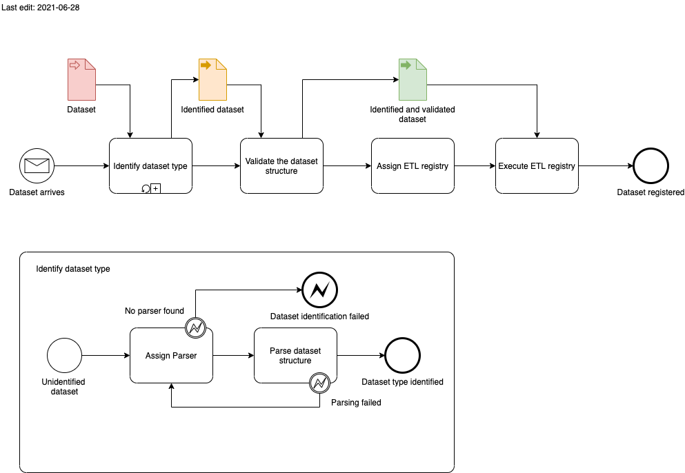

# OpenBIS dropboxes written in Java/Groovy
In development experimental ETL procedures written in Java for data registration in openBIS.

Overview:

- [Build JAR artifact](#build-jar-artifact)
- [Deployment in openBIS DSS](#deployment-in-openbis-dss)
- [Dataflow](#dataflow)
    * [Overview](#overview)
    * [Structure](#structure)
    * [Add a new dataset parser](#add-a-new-dataset-parser)
    * [Add a new dataset registry](#add-a-new-dataset-registry)

## Build JAR artifact

Clone the repository with 

```
git clone git@github.com:qbicsoftware/java-openbis-dropboxes.git
```

and run 

```
mvn clean package
```

The compiled Java binaries are located under the projects root folder under `./target/<project-name>.jar`

## Deployment in openBIS

To activate the dropbox, you have to deploy the JAR package in your DSS dropbox in a folder called `lib`. As the openBIS classloader does not load classes dynamically, you need to restart the the DSS to add the classes to the runtime.

## Dataflow 

### Overview
The overall logic that is implemented by this dropbox, follows the process displayed in the following
process diagram:



**Dataset arrives**. That means that a new dataset has been dropped, in the active openBIS datastore server dropbox.

**Identify dataset type**. In this step, several dataset parsers are applied to parse the current dataset structure. If no parser is available, that is able to parse the dataset structure successfully,
then this step exits with an identification exception and manual intervention is necessary.

**Validate dataset structure**. In this step, the dataset is validated. A dataset is valid, if its structure follows a certain specification. Every dataset structure
is expressed in a JSON schema, maintained in the central [data model library](https://github.com/qbicsoftware/data-model-lib). 

**Assign ETL registry**. After the dataset has been identified and is found valid, the ETL registry is assigned by the dataset type. The assignment must be unambiguous, 
meaning that one registry takes care of one dataset type!

**Execute ETL registry**. This is the last crucial step. The registry is triggered and tries to register
the dataset in openBIS.

### Structure

The main entry point is the Groovy class [MainETL](src/main/groovy/life/qbic/registration/MainETL.groovy):

```groovy
@Log4j2
class MainETL extends AbstractJavaDataSetRegistrationDropboxV2 {

    static List<DatasetParser<?>> listOfParsers = [
            new BioinformaticAnalysisParser(),
            new NanoporeParser()
    ] as List<DatasetParser<?>>
    // ...
    @Override
    void process(IDataSetRegistrationTransactionV2 transaction) {}
```

We need to extend from the abstract class `AbstractJavaDataSetRegistrationDropboxV2`, which serves the entry
point we need to define in the [dropbox configuration file](https://github.com/qbicsoftware/etl-scripts/blob/master/drop-boxes/register-all-dropbox/plugin.properties). The abstract method ``process()`` is then called
by the openBIS DSS runtime, once a dataset is dropped in the dropbox and a marker file has been created.

First, we try to parse and validate the incoming dataset. This is done by the 
[DataSetParserHandler](src/main/groovy/life/qbic/registration/handler/DatasetParserHandler.groovy).
The handler takes a list of available `DataSetParsers`, parsers that implement the interface defined in our [core-utils library](https://github.com/qbicsoftware/core-utils-lib/blob/master/src/main/groovy/life/qbic/datasets/parsers/DatasetParser.groovy).
The approach is simple brute force, the first parser that is able to identify the dataset
determines the type of the returned data set.

```groovy
//...
void process(IDataSetRegistrationTransactionV2 transaction) {
  //..  
  DatasetParserHandler handler = new DatasetParserHandler(listOfParsers)
  Optional<?> result = handler.parseFrom(relevantData)
  //..
}
```

The next step is to determine the correct [Registry](src/main/groovy/life/qbic/registration/handler/Registry.groovy). This
is done by the [RegistrationHandler](src/main/groovy/life/qbic/registration/handler/RegistrationHandler.groovy):

You can request the correct registry using its static factory method:

```groovy
static Optional<Registry> getRegistryFor(Object dataset) {
  Optional<Registry> registry
  switch (dataset) {
      case NfCorePipelineResult:
          registry = Optional.of(new NfCoreResultRegistry(dataset as NfCorePipelineResult))
          break
      //...
      default:
          registry = Optional.empty()
  }
  return registry
  }
```

Once a registry is assigned just execute the registration, by calling the ``executeRegistration()`` method
on the registry. 

### Add a new dataset parser

The parsers are provided by the [core-utils library](https://github.com/qbicsoftware/core-utils-lib), and that is where they should be implemented.

We encourage you to take the [BioinformaticAnalysisParser](https://github.com/qbicsoftware/core-utils-lib/blob/master/src/main/groovy/life/qbic/utils/BioinformaticAnalysisParser.groovy)
as a reference implementation of the [DataSetParser interface](https://github.com/qbicsoftware/core-utils-lib/blob/master/src/main/groovy/life/qbic/utils/BioinformaticAnalysisParser.groovy).

Once the implementation is ready, include the new version of the core-utils library in this project and
extend the available parser list in the [MainETL](src/main/groovy/life/qbic/registration/MainETL.groovy):

```groovy
@Log4j2
class MainETL extends AbstractJavaDataSetRegistrationDropboxV2 {

    static List<DatasetParser<?>> listOfParsers = [
            new BioinformaticAnalysisParser(),
            new NanoporeParser()
    ] as List<DatasetParser<?>>
```

That's all the magic.

### Add a new dataset registry

Of course, if you have added a new data set parser, then you most likely need a new dataset
registry, that will handle the final registration in openBIS.

For this make sure to implement the [Registry interface](src/main/groovy/life/qbic/registration/handler/Registry.groovy). Once you have provided an implementation
of the interface, add your new registry to the [Registration handler](src/main/groovy/life/qbic/registration/handler/RegistrationHandler.groovy):

```groovy
static Optional<Registry> getRegistryFor(Object dataset) {
  Optional<Registry> registry
  switch (dataset) {
      case NfCorePipelineResult:
          registry = Optional.of(new NfCoreResultRegistry(dataset as NfCorePipelineResult))
          break
      //...
      default:
          registry = Optional.empty()
  }
  return registry
  }
```
**Note:** Please make sure that you always have an **unambiguous assignment** of a certain dataset type to a registry. 
